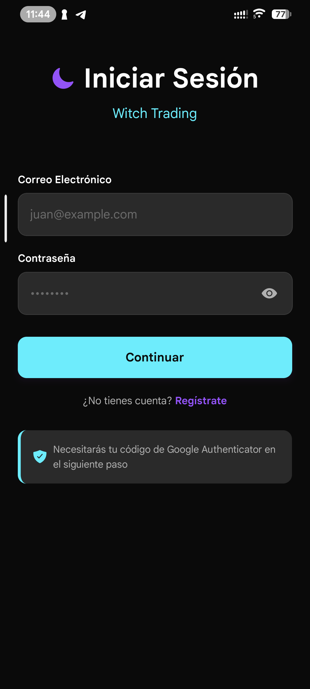
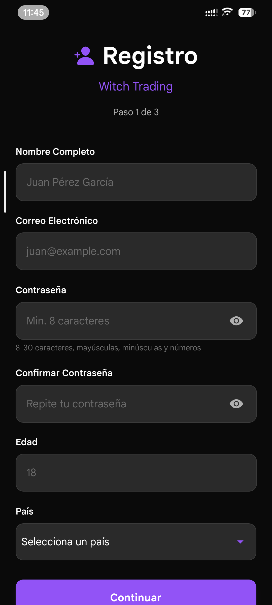
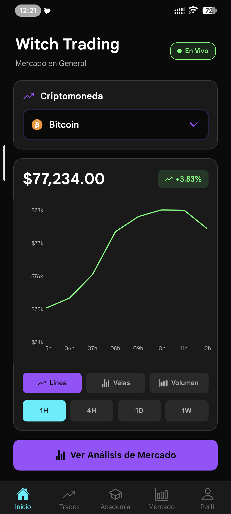
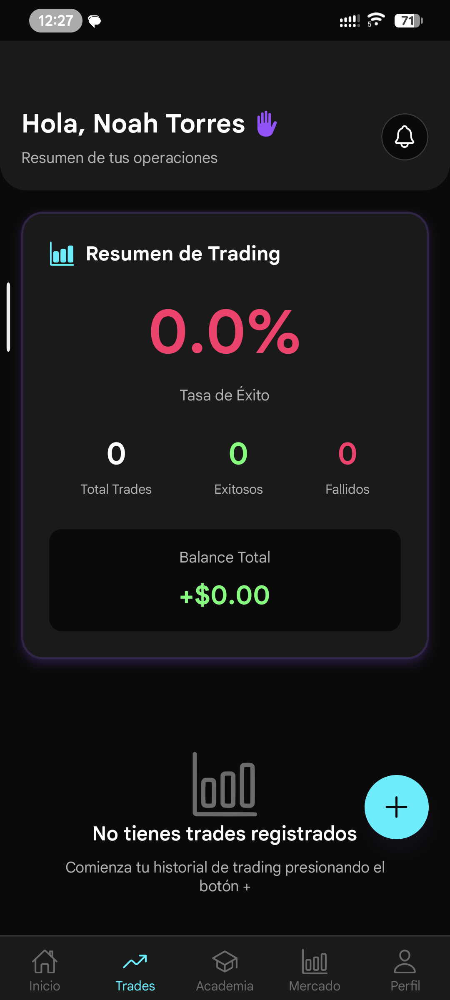
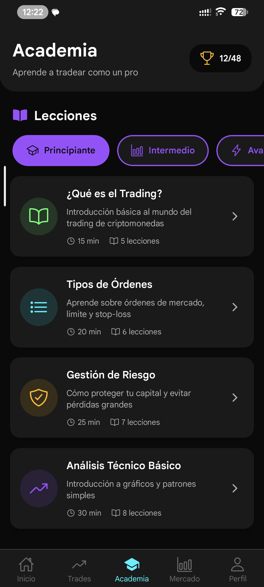
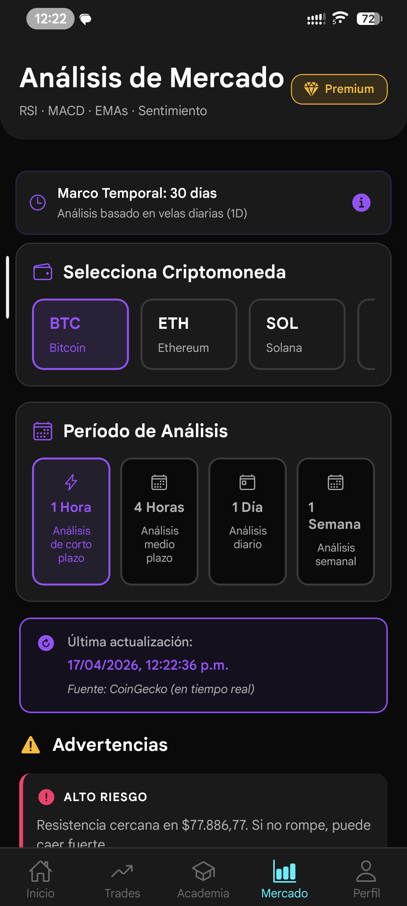
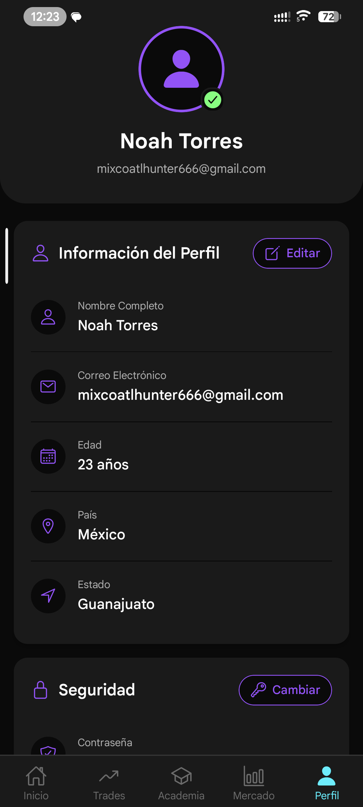

# Witch Trading

## 1. Descripción general

Witch Trading es un proyecto de toma de decisiones en trading con dos componentes principales:

- **Backend**: API REST en Node.js con Express, comunicación en tiempo real, tareas programadas y manejo de datos de trading.
- **Aplicación móvil**: App desarrollada en **React Native / Expo** para Android/iOS, con autenticación, panel de trades, mercado y academia.

> Esta documentación se centra en el backend y la versión móvil.

## 2. Objetivo del proyecto

El proyecto busca demostrar capacidad para desarrollar una aplicación de trading con:

- Autenticación segura y sesiones controladas
- Consumo de datos de mercado (criptomonedas)
- Gestión de posiciones / trades
- Comunicación en tiempo real con WebSocket
- Envío de notificaciones push
- Experiencia de usuario móvil con interfaz moderna

## 3. Arquitectura general

### 3.1 Backend

El backend está estructurado con capas claramente separadas:

- `src/index.js`: arranque del servidor, configuración de middlewares, rutas, WebSocket y Cron.
- `src/routers/`: define endpoints de la API.
- `src/controllers/`: recibe solicitudes y delega la lógica.
- `src/service/`: implementa la lógica de negocio, consumo de APIs externas y sincronización de datos.
- `src/models/`: modelos de datos y acceso a la base de datos.
- `src/middlewares/`: validaciones, parsing JSON, autenticación y límite de acceso.
- `src/helpers/`, `src/utils/`, `src/validators/`: utilidades, validaciones y funciones auxiliares.
- `database/`: migraciones, scripts de sincronización, inserción de datos y limpieza.

### 3.2 Móvil

La app móvil usa Expo con una arquitectura basada en:

- `App.js`: punto de entrada, proveedor de contexto de autenticación y navegación principal.
- `context/AuthContext.js`: estado de sesión, tokens y refresco automático.
- `navigation/`: navegación de pestañas y pila.
- `screens/`: pantallas principales de login, registro, home, trades, academia, mercado y perfil.
- `api/`: cliente HTTP y autorización.
- `utils/` y `constants/`: almacenamiento seguro, configuración de toasts y colores.

## 4. Backend: funcionamiento y componentes clave

### Stack tecnológico

- Node.js 20+ / ECMAScript modules
- Express 5
- Sequelize + PostgreSQL
- WebSocket (`socket.io`)
- Cron jobs (`node-cron`)
- JWT / autenticación
- `multer` para subida de archivos
- `axios` para llamadas a APIs externas
- `bcrypt`, `speakeasy`, `jsonwebtoken`, `dotenv`

### Funcionalidad principal

- `auth`: inicio de sesión, registro y flujo de OTP.
- `usuarios`: creación, consulta y actualización de usuarios.
- `trades`: creación, listado y detalle de operaciones de trading.
- `criptos`: datos de criptomonedas y señales de mercado.
- `comunidad`: publicaciones, comentarios y actividad social.
- `upload`: subida de archivos, perfil e imágenes.
- `push`: envío de notificaciones push.
- `signals`: manejo de señales de trading y sincronización.
- `websocket`: actualizaciones en tiempo real para clientes conectados.

### Servicios y tareas programadas

- `cron_service.js`: ejecuta tareas periódicas para sincronizar datos de mercado y enviar actualizaciones.
- `websocket_service.js`: administra conexiones en tiempo real y envía eventos a clientes.
- `analysis_service.js`, `coingecko_service.js`, `binance_service.js`: integraciones con APIs externas para obtener datos financieros.

### Seguridad y manejo de errores

- Middlewares globales para parseo JSON y detección de JSON mal formado.
- Respuestas estándar con códigos y mensajes personalizados.
- Manejo de rutas no encontradas y errores del servidor.

## 5. App móvil: funcionamiento y features

### Stack tecnológico

- Expo
- React Native 0.81
- React Navigation
- Async Storage
- Chart Kit para visualización de datos
- WebView para contenidos externos
- Notificaciones con `expo-notifications`
- Image Picker y manejo de multimedia

### Flujo de usuario

1. Pantallas de autenticación:
   - `LoginScreen`
   - `LoginOTPScreen`
   - `RegisterStep1Screen`, `RegisterStep2Screen`, `RegisterStep3Screen`
2. Pantallas del usuario autenticado:
   - `HomeScreen`
   - `TradesDashboardScreen`
   - `CreateTradeScreen`
   - `TradeDetailScreen`
   - `TradingLevelsScreen`
   - `AcademyScreen`
   - `LessonDetailScreen`
   - `MarketScreen`
   - `UserSettingsScreen`

### Experiencia móvil

- Navegación de pestañas mediante `MainTabNavigator`
- Inicio rápido con carga y estado seguro de sesión
- Refresco automático de token cuando la app vuelve a primer plano
- Mensajes Toast para alertas y errores
- Diseño orientado a tema oscuro con colores definidos en `constants`

### Gestión de sesión

- `AuthContext` mantiene el estado global de autenticación.
- Guarda tokens y datos de sesión en almacenamiento seguro.
- Soporta cierre de sesión y refresco silencioso de access token.
- Manejo de expiración de sesión con notificaciones al usuario.

## 6. Cómo ejecutar el proyecto

### Backend

```bash
cd backend
npm install
npm run dev
```

- El servidor arranca en `http://localhost:3000` o en el puerto definido en `.env`.
- El backend monta rutas de API y WebSocket, además de iniciar tareas cron.

### Móvil

```bash
cd frontend/mobile
npm install
npm start
```

- Ejecutar con Expo en Android o iOS.
- La app móvil se conecta al backend para autenticación, datos y actualizaciones.

## 7. Estado actual del proyecto

- **Backend**: Backend desplegado en Railway.
- **Móvil**: App móvil funcional en Android con autenticación, dashboard de trades y datos de mercado en tiempo real. Integración con CoinGecko y Binance APIs activa.

## 8. Evidencia y capturas

- 
- 
- 
- 
- 
- 
- 

**[Ver todas las pantallas →](./pantallas/)**

